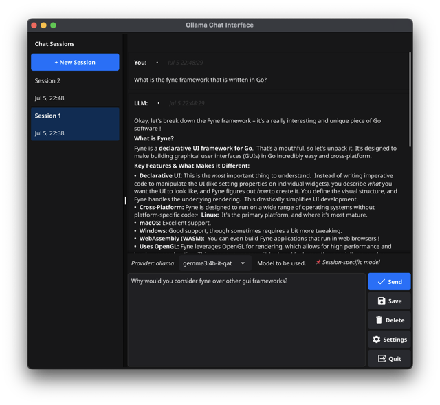

# OllamaChat

## Introduction

OllamaChat is a modular Go application built with industry-standard architecture patterns for interacting with Local Language Model (LLM) servers. The application features a clean separation of concerns with dependency injection, structured logging, configuration management, and extensible provider abstractions. It demonstrates efficient streaming response handling using Go's concurrency model and provides a responsive user interface built with the Fyne framework.

The application is designed with future extensibility in mind, providing a foundation for advanced features like Model Context Protocol (MCP) client/server support, agentic frameworks, and multi-provider LLM integration.

## Screenshot



*OllamaChat running on macOS showing the clean, intuitive interface with model selection, streaming responses, and persistent chat history.*

## Acknowledgments

Shout out to [Fyne](https://fyne.io/) for providing a powerful and intuitive GUI library that simplifies our development process. This project is made possible by the contributions of the Fyne community, and their efforts in creating an excellent and promising framework is appreciated.

## Setup Instructions

1. **Install Go**: Ensure you have Go installed. You can download it from [the official website](https://golang.org/dl/).
2. **Install Docker**: `fyne-cross` requires Docker to be available on your system. You can download Docker from [the official website](https://www.docker.com/products/docker-desktop).
3. **Install fyne-cross**: Install `fyne-cross` by running:

   ```bash
   go install github.com/fyne-io/fyne-cross@latest
   ```
   Ensure that your Go bin directory (usually `$HOME/go/bin`) is in your `PATH` so you can run `fyne-cross` from the terminal.

4. **Build the Project**: Navigate to the project directory in your terminal and use one of the following methods:
   
   **Option 1 - Quick development build using Makefile:**
   ```bash
   make build
   ```
   
   **Option 2 - Manual build:**
   ```bash
   go build -o ollamachat cmd/ollamachat/main.go
   ```
   Or simply:
   ```bash
   go build
   ```
5. **Run the Program**: Use `./ollamachat` to start the application.

### Using the Makefile

A Makefile is provided to simplify the build process. It utilizes `fyne-cross` to build the project for multiple platforms.

#### Quick Development Build

For rapid development and testing, use the `build` target to create a local binary:

```bash
make build
```

This creates a `./ollamachat` executable for your current platform without packaging.

#### Complete Multi-Platform Build

To build all targets for all platforms, use:

```bash
make all
```

This command will execute all the necessary steps to build the project for all supported platforms, ensuring that all dependencies are handled correctly.

#### Building for Specific Platforms

To build binaries for all architectures of a specific platform, use the `platform` target. Set the `PLATFORM` variable to the desired platform:

```bash
make platform PLATFORM=linux
```

#### Building for Specific Platform and Architecture

To build a binary for a specific platform and architecture combination, use the `platform-arch` target. Set both the `PLATFORM` and `ARCH` variables:

```bash
make platform-arch PLATFORM=linux ARCH=amd64
```

#### Available Makefile Targets

- **`make build`**: Quick development build for current platform
- **`make all`**: Build for all platforms (requires Docker for cross-compilation)
- **`make darwin-arm64`**: Build and package for macOS ARM64 (native builds)
- **`make darwin-amd64`**: Build for macOS Intel (with compatibility notes)
- **`make windows`**: Build for Windows (all architectures)
- **`make linux`**: Build for Linux (all architectures)
- **`make clean`**: Remove all build artifacts

For more information about `fyne-cross`, visit the [fyne-cross GitHub repository](https://github.com/fyne-io/fyne-cross).

## Project Structure

OllamaChat follows Go's standard project layout with a modular architecture:

```
ollamachat/
├── cmd/ollamachat/          # Application entry point
│   └── main.go             # Main executable
├── internal/               # Private application code
│   ├── app/               # Application container and dependency injection
│   ├── config/            # Configuration management
│   ├── llm/               # LLM provider abstractions and implementations
│   ├── models/            # Data models and structures
│   ├── storage/           # Storage abstractions and implementations
│   └── ui/                # User interface components
├── pkg/                   # Public libraries
│   └── logger/            # Structured logging
├── configs/               # Configuration files
│   └── config.yaml        # Application configuration
├── data/                  # Application data directory
│   ├── preferences.json   # User preferences
│   └── sessions/          # Chat session storage (future)
└── fyne-cross/           # Cross-compilation artifacts
```

### Data Directory Structure

The `data/` directory contains all persistent application data:

- **`preferences.json`**: Stores user preferences including window size, theme, font settings, and feature flags
- **`sessions/`**: Future directory for individual chat session files (*.json)
- **Legacy compatibility**: The application maintains backward compatibility with existing `chat_history.json` files stored in Fyne's app storage

The application automatically creates the data directory and required files on first run.

## Configuration

The application uses a YAML configuration file (`configs/config.yaml`) for centralized settings management:

```yaml
app:
  name: "OllamaChat"
  version: "1.0.0"
  log_level: "info"

llm:
  providers:
    - name: "ollama"
      type: "ollama"
      base_url: "http://localhost:11434"
      timeout: 30
      enabled: true
  default_provider: "ollama"

storage:
  type: "file"
  base_path: "data"

ui:
  theme: "auto"
  window:
    width: 600
    height: 700
  font_size: 12
```

Configuration can be modified by editing the YAML file or through the application preferences (stored in `data/preferences.json`).

## Future Capabilities & Extensibility

The application architecture is designed to support advanced features planned for future releases:

### Model Context Protocol (MCP) Support
- **MCP Client**: Ready for integration with MCP servers for enhanced tool capabilities
- **MCP Server**: Framework in place to run as an MCP server itself
- **Data Models**: `internal/models/mcp.go` contains MCP-specific data structures

### Agentic Framework Integration
- **Agent Configuration**: Support for multiple agentic frameworks (Eino, AutoGen, etc.)
- **Tool Integration**: Built-in and MCP-provided tools
- **Concurrent Execution**: Multi-agent workflow support

### Multi-Provider LLM Support
- **Provider Abstraction**: `internal/llm/provider.go` defines interfaces for multiple LLM providers
- **Extensible Design**: Easy addition of new providers (OpenAI, Anthropic, Cohere, etc.)
- **Provider Switching**: Runtime provider selection capability

### Session Management
- **Multi-Session Support**: Framework for managing multiple chat sessions
- **Session Persistence**: Individual session storage in `data/sessions/`
- **Session Import/Export**: Planned support for session sharing

### Advanced Features
- **Structured Logging**: Comprehensive logging with configurable levels
- **Configuration Management**: Hot-reload configuration changes
- **Plugin Architecture**: Extensible component system
- **API Server Mode**: Future REST API capabilities

## Usage

1. **Launch the Program**: Execute the binary without additional arguments.
2. **Fetch Available Models**: Upon startup, the program retrieves a list of models from the LLM server.
3. **Select a Model**: Users can select a model from a dropdown to determine which model the LLM server will use for query processing.
4. **Submit a Query**: Type a query into the text field and send it to the LLM.
5. **Receive Streaming Response**: The application processes the LLM's streaming responses and updates the UI in real-time.
6. **Persistent Chat History**: Chat history is automatically saved and restored between sessions. Clearing the chat will also clear the saved history.
7. **Context Window for LLM**: The LLM receives previous messages as context (not just the latest message). By default, only the last 10 messages are sent for context.
8. **Export Chat**: Use the "Save" button to export the conversation as plain text, using the original message content.

## Architecture & Implementation

### Modular Design

The application follows clean architecture principles with clear separation of concerns:

- **Dependency Injection**: The `internal/app` package provides a container that manages all dependencies
- **Interface Abstractions**: Storage and LLM providers are defined through interfaces for easy testing and extension
- **Structured Logging**: Contextual logging with component identification throughout the application
- **Configuration Management**: Centralized configuration with validation and environment support

### Concurrency

For efficient execution and a responsive UI, the application leverages Go's concurrency features:

- **Goroutines for Long Operations**: LLM queries are executed in separate goroutines to prevent UI blocking

  ```go
  go ui.sendMessageToLLM(ctx, selectedModel, fullPrompt)
  ```

- **Context for Request Cancellation**: The context package enables user-initiated request cancellation

  ```go
  ctx, cancelFunc := context.WithCancel(context.Background())
  ui.cancelFunc = cancelFunc
  ```

- **Thread-Safe Operations**: All UI updates and data operations are properly synchronized

### Streaming Responses

The application handles streaming responses from the LLM through the provider abstraction:

- **Provider Interface**: The `llm.Provider` interface abstracts streaming response handling

  ```go
  err := provider.SendQuery(ctx, model, prompt, func(chunk string, newStream bool) {
      // Handle streaming response chunks
      if newStream {
          // Start new response
          llmResponse = chunk
      } else {
          // Append to existing response
          llmResponse += chunk
      }
      // Update UI dynamically
  })
  ```

- **Real-time UI Updates**: The UI components update incrementally as response chunks arrive
- **Auto-scrolling**: Smart scroll behavior maintains user focus during long responses

### Context Handling & Cancellation

The application uses Go's context package for efficient request lifecycle management:

- **Cancellation Support**: Users can cancel ongoing requests through the UI

  ```go
  if ui.cancelFunc != nil {
      ui.cancelFunc()
      // Request is cancelled and UI is updated
  }
  ```

- **Timeout Management**: Configurable timeouts for LLM requests
- **Resource Cleanup**: Proper cleanup of resources when requests are cancelled or complete

## User Interface

The UI is implemented in the `internal/ui` package with modular, reusable components:

### Component Architecture

- **ChatUI**: Main chat interface with dependency injection
- **Reusable Components**: Shared UI components in `internal/ui/components.go`
- **Responsive Design**: Dynamic sizing and adaptive layouts

### Model Selection

The model dropdown dynamically sizes to accommodate the longest model name:

```go
func (ui *ChatUI) calculateModelSelectWidth() float32 {
    longestModel := ""
    for _, model := range ui.modelSelect.Options {
        if len(model) > len(longestModel) {
            longestModel = model
        }
    }
    return canvas.NewText(longestModel, nil).MinSize().Width
}
```

### Message Display

- **Rich Text Support**: Markdown rendering for formatted messages
- **User/LLM Distinction**: Clear visual separation between user and assistant messages
- **Auto-scrolling**: Smart scroll behavior during streaming responses

## Troubleshooting

- **LLM Not Responding**: Check the provider configuration in `configs/config.yaml` and ensure the LLM server is running
- **Configuration Issues**: Verify the YAML syntax in `configs/config.yaml` and check application logs
- **Storage Issues**: Ensure the `data/` directory is writable and has sufficient space
- **Build Issues**: Ensure Go version compatibility and all dependencies are available
- **UI Issues**: Check display scaling and window manager compatibility

### Logging

The application provides structured logging with configurable levels. Set the log level in `configs/config.yaml`:

```yaml
app:
  log_level: "debug"  # debug, info, warn, error
```

Logs include component identification to help with debugging specific parts of the application.

## References

- [Go Project Layout](https://github.com/golang-standards/project-layout) - Standard Go project structure
- [Clean Architecture in Go](https://blog.cleancoder.com/uncle-bob/2012/08/13/the-clean-architecture.html) - Architectural principles
- [Fyne Framework Documentation](https://fyne.io/) - GUI framework
- [Model Context Protocol](https://modelcontextprotocol.io/) - Future MCP integration
- "The Go Programming Language" by Brian Kernighan and Alan Donovan
- "Clean Architecture" by Robert C. Martin

## License

This project is released under the MIT License. Please refer to the `LICENSE` file for more details.
